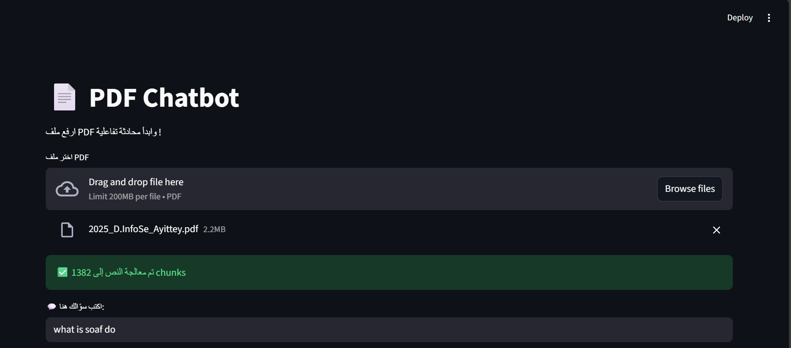
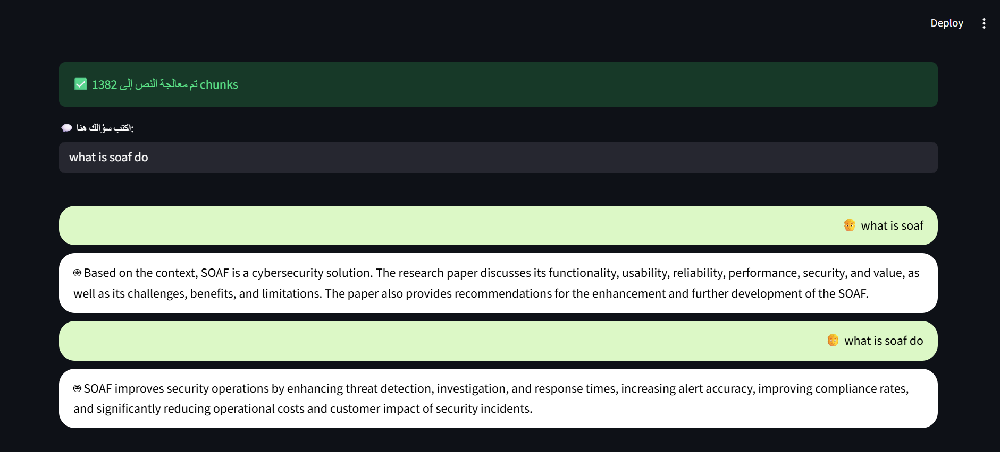

# 📄 PDF Chatbot with Streamlit + LangChain + Google GenAI

## 🚀 Overview
A web app that allows you to upload PDF files and interact with them by asking natural language questions, just like ChatGPT.  

Built using:
- [Streamlit](https://streamlit.io) for the user interface  
- [LangChain](https://www.langchain.com) for text processing and conversational chains  
- [Google Gemini API](https://ai.google.dev) as the LLM  
- [FAISS](https://faiss.ai) as the vector database  
- [HuggingFace embeddings](https://huggingface.co) for semantic search  

---

## ⚡ Features
- Upload and process PDF files  
- Chunking and semantic search on extracted text  
- Conversational memory to maintain context  
- Powered by Google Gemini 2.0 Flash for fast responses  

---

## 📦 Installation
Clone the repository:
```bash
git clone https://github.com/username/pdf-chatbot-streamlit.git
cd pdf-chatbot-streamlit
````

(Optional) Create a virtual environment:

```bash
python -m venv venv
source venv/bin/activate   # On Linux/Mac
venv\Scripts\activate      # On Windows
```

Install the dependencies:

```bash
pip install -r requirements.txt
```

---

## 🔑 Setup

1. Copy `.env.example` to `.env`
2. Add your Google API key:

```
GOOGLE_API_KEY=your_api_key_here
```

---

## ▶️ Run

Start the app with:

```bash
streamlit run app.py
```

Open the app in your browser at `http://localhost:8501`

---

## 📸 Screenshot








---

## 📂 Project Structure

```
pdf-chatbot-streamlit/
│
├── app.py                # Main Streamlit app
├── requirements.txt      # Project dependencies
├── .env.example          # Example environment file
├── README.md             # Project documentation
├── .gitignore            # Ignore sensitive/unnecessary files
├── screenshots/          # Screenshots for README
│   └── screenshot.png
```

---

## 📜 License

This project is licensed under the MIT License. You are free to use and modify it.

---

✍️ Developed by: **Barah Qusai**

